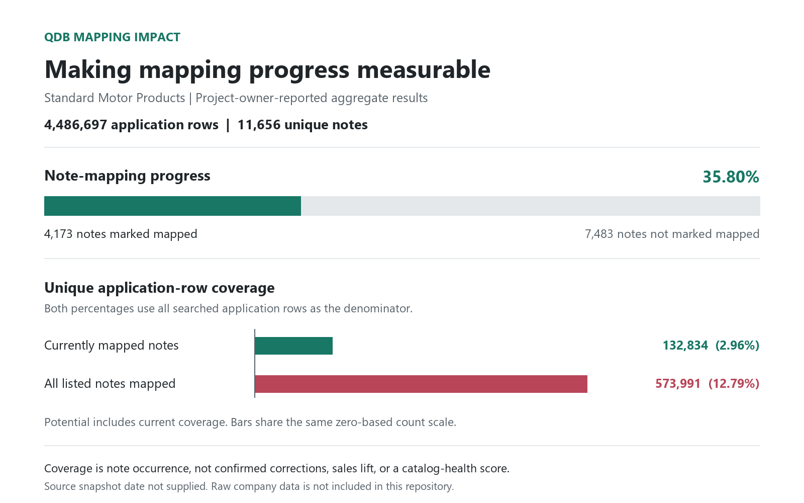

# Qdb Mapping Automation and Catalog Impact

**Python automates the mapping work. SQL analyzes the results, review priorities, and application-level impact.**

By [Can Kuvelet](https://github.com/Kuvelet) | Standard Motor Products case study

## Why I Built This

An aftermarket catalog may contain the same application note thousands of times, under different product descriptions and in different fields. Reviewing those records individually is inefficient. But reviewing only a unique-note list leaves another question unanswered: **where does each mapping decision matter across the catalog?**

This is a **Python automation and SQL analytics project**. Python/Selenium scripts apply spreadsheet-supplied mappings through the PIM interface; SQL makes their status and occurrence footprint measurable by connecting low-confidence notes and mapping status to the application catalog. The aim is to reduce repetitive mapping effort, organize the remaining review, and show where mapping progress matters to the business.

The SQL tracker is one output of the project, not the project itself. Supporting work includes large-file ingestion, unique-note preparation, query optimization, overlap analysis, description-level prioritization, and team reporting.

## What Is Qdb?

**Qdb means Qualifier Database.** It is an Auto Care Association reference database used with ACES to represent fitment conditions in standardized, coded form instead of inconsistent free-text notes. Qualifiers can also contain parameters for variable values. [Official Qdb overview](https://www.autocare.org/data-and-information/data-standards/databases/qualifier-database-qdb).

In plain language, **fitment means whether a part applies to a particular vehicle or equipment configuration**. ACES communicates that application information; PIES communicates information about the product itself. [ACES](https://www.autocare.org/aces), [PIES](https://www.autocare.org/pies).

The business concern is not just cleaner wording. Important conditions must remain understandable when catalog content moves from a manufacturer to distributors, retailers, and lookup systems. This project combines repeatable mapping entry with evidence of where those notes recur. [Examples, aftermarket importance, and limitations](docs/standards-context.md).

## Two Complementary Layers

| Layer | Responsibility |
|---|---|
| Python automation | Three attended Selenium workflows apply supplied Qdb text with zero, one, or two parameters, then log each attempted mapping. Reviewed adaptations of the original scripts are included. |
| SQL analysis | Analyzes the note population, mapping status, source-field occurrences, and current versus potential application coverage. The report implementation is included. |

## The Workflow

| Step | What we did | Why it mattered |
|---|---|---|
| Make the data usable | Worked with raw SQL tables and later loaded a large TSV using PowerShell and bcp | Made an export that was impractical to open interactively available for analysis |
| Define the review backlog | Extracted unique note values while retaining raw records separately | Separated one mapping-review item from its many occurrences |
| Understand application usage | Matched notes across selected application fields and retained unmatched notes | Revealed product context, repetition, and exceptions |
| Automate the mapping work | Used Excel-driven Python/Selenium scripts for no-, single-, and dual-parameter mappings | Repeats PIM filtering, qualifier selection, parameter entry, Save, and per-row logging |
| Make the analysis reliable | Staged SQL processing, used narrow hash keys, and separated cells from unique rows | Addressed execution issues and prevented inflated impact counts |
| Prioritize and communicate | Ranked descriptions by note occurrences; built overall and detailed reports | Supported focused review clusters and understandable progress updates |

The table groups responsibilities, not a verified execution order. The SQL work was iterative: its first discussion used an existing table, and a later large-file import extended that analysis. The mapping decisions are supplied in Excel; batch outcomes must be reviewed before manually refreshing the SQL mapping-status input. Read the [project story and decision history](docs/project-story.md).

**Repository coverage:** `automation/` contains reviewed adaptations of the three supplied PIM scripts; `sql/` contains the impact analysis. The separate `qdb_impact/` package is a synthetic reference model for the report, not the mapping automation. Earlier ingestion commands are reconstructed examples. [Script provenance](docs/scripts.md).

**Execution boundary:** these are attended workflows that apply preselected mappings, not AI-based mapping discovery. They remove existing mappings before adding replacements. The adapted scripts default to local preview, and no live PIM run was performed during repository preparation. [Workflow, controls, and limitations](docs/python-automation.md).

## What the Tracker Shows

- How many unique notes are marked mapped, out of the complete backlog.
- Where each note appears: descriptions, matching field names, and unique-row counts.
- Which descriptions contain the most occurrences of notes from the full list.
- How many unique application rows contain currently mapped notes.
- How many rows could be reached if every listed note were mapped.
- Which notes have no match, so unresolved items do not disappear.

The key counting rule is simple: **two matching cells on one application row are two occurrences, but only one unique row.** Overall coverage is calculated from row IDs, not by adding overlapping per-note counts.

## Reported Results

Source population: **4,486,697 application rows**.

| Measure | Current mapped-note status | If all listed notes were mapped |
|---|---:|---:|
| Unique notes marked mapped | 4,173 | 11,656 |
| Note-backlog completion | 35.80% | 100.00% |
| Unique application rows containing those notes | 132,834 | 573,991 |
| Share of application rows searched | 2.96% | 12.79% |
| Description groups containing those notes | 11 | 631 |



These project-owner-reported figures describe **note occurrence and potential reach**, not confirmed production corrections or measured sales/return improvements. Potential includes current coverage. Company attribution and aggregate totals were approved for this draft; raw records are not included. [Evidence and limitations](docs/evidence-and-limitations.md).

## Start Here

| You want to understand... | Read |
|---|---|
| What Qdb is and why fitment qualifiers matter in the aftermarket | [Standards explained](docs/standards-context.md) |
| The original problem, all stages, and why decisions changed | [Project story](docs/project-story.md) |
| The aftermarket business value and catalog-health implications | [Business case](docs/business-case.md) |
| The Python execution flow, workbook schemas, and run controls | [Python automation](docs/python-automation.md) |
| Which scripts do what, where they came from, and how they connect | [Script guide](docs/scripts.md) |
| The exact counting rules and SQL design | [Metric reference](docs/metrics.md) and [architecture](docs/architecture.md) |
| How to run the example or adapt the SQL | [Runbook](docs/runbook.md) |
| How to present the project on a resume or portfolio | [Portfolio copy](docs/portfolio.md) |

## Run the Synthetic Demo

Python 3.10+, no external packages or database credentials required:

```bash
python -m qdb_impact
python -m unittest discover -s tests -v
python tools/build_demo.py --check
```

The demo writes JSON and Markdown to `outputs/demo/`. Its invented example has **5 notes, 3 mapped, 5 mapped cells, 3 currently covered rows, and 4 potential rows out of 6 total**. It does not reproduce the private company dataset.

For SQL Server 2017+ and compatibility level 110+, run [the demo inputs](sql/00_demo_inputs.sql) and then [the report](sql/10_impact_report.sql) in the same SSMS session. [Full instructions](docs/runbook.md).

## Repository Layout

```text
automation/   Three source-derived PIM workflows and shared preview/run controls
sql/          SQL report, synthetic inputs, and private adapter template
qdb_impact/   Reference demo for explaining and testing the report
tests/        Mocked automation, counting, SQL result-SELECT, and repository checks
tools/        Example generation, chart generation, optional SQL verification
docs/         Project story, business reasoning, script guide, and references
examples/     Synthetic input and expected output
evidence/     Approved aggregate figures only
assets/       Case-study chart
```

The SQL report reads source data and creates temporary analysis tables; it does not deploy mappings. The Python automation can change mappings only during an explicitly enabled live run. Full target SQL Server execution and live PIM validation of the adapted edition remain unverified.

Independent portfolio case study; not an official company or Auto Care product. See [NOTICE](NOTICE.md) and [publication checklist](docs/publishing.md) for attribution and code-release boundaries.
